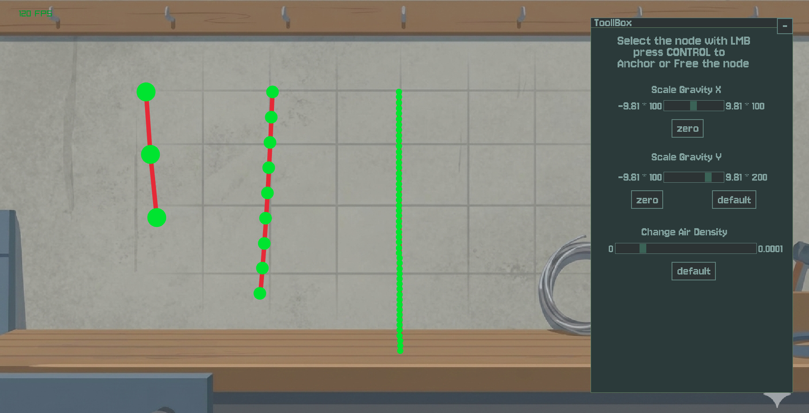

# Rope Physics Simulation

A 2D rope physics simulation built with C++ and Raylib.
It features: Verlet integration for realistic rope movement and mouse interaction, Multithreaded constraints solver that uses a custom Threadpool class, rendering with culling of invisible rope parts.

Its is made to be an example of a rope simulation for educational purposes or as a base for your own rope simuation.



## Documentation
- the scripts are well commented, code is written to be simple and readable, however ther is **No official documentation** beyond the source comments.

## Features
- **A sub-step system**: all physics is running inside an internal sub-step loop to break down frame into smaller parts for better stability 
- **Physics**: Custom physics solver using Verlet integration.
- **Interaction**: Drag and drop rope nodes with the mouse: Right Click to move the camera, hold Left Click to drag a node, press CONTROL while dragging a node to swich its Anchored mode.
- **Constraints solver**: a relaxation based constraint solver. It runs a specified amount of iterations for stability

## Installation
1. Clone the repository.
2. Build the project (However, you'll need to change the premake file if you aren't using Visual Studio 2022)
3. Open created solution
4. Select **Debug** or **Release** and hit **F5** to build and run.

**Alternatively**: you can install the latest build and run the program.

## Workflow

- **setup the config, physics,threadpool and GUI rendering**:```Config DefaultConfig;	//set up config, physics, GUI rrendering```
```InteractionConfig DefaultInteractionCFG;```
```Threadpool threadpool(std::thread::hardware_concurrency());```

```RopePhysicsSolver DefaultSolver(DefaultConfig, threadpool);```
```GUI_Renderer GUI(DefaultSolver, DefaultConfig);```

- **setup your rope**: ```DefaultSolver.SetupRope(Vector2{200,100}, true, 9, 40, 10);```*a rope with the first node at the position X: 200; Y: 100, first node is anchored (pinned, cant move), 9 nodes in total, the maximum distance between each node is 40 units, each node's radius is 10 units*

- **Update all ropes physics, render them and handle interaction**: ```double frameTime = 1.0 / DefaultConfig.TargetFPS;```
```DefaultSolver.HandleRopes(mainCamera, 6, 5, frameTime);``` *using 6 substeps and 5 iterations (five per sub-step)*


## Controls
- **Left Mouse**: Drag rope nodes.
- **CONTROL while dragging**: Anchore the ropenode.
- **Right Mouse**: Pan the camera.
- **Scroll Wheel**: Zoom.

## Acknowledgments
- [Raylib](https://www.raylib.com/) for the simple graphics library.
- Verlet integration technique for stable physics.
- Various Youtube tutorials and other educational sources.


## Limitations & Notes
- Some constants (like gravity) are tuned specifically for Raylib's coordinate system
- Porting to other frameworks may require parameter adjustments
- constraint solver parralelizes per-rope, so if you want to have a long rope it will be assigned to one thread and this may stall the simulation.


### TO-DO:
1. ~Refactor some functions and classes.~
1. ~Add functions to update physics and interaction across all existing ropes.~
1. ~Implement UI via raygui.~
1. ~Add dynamic rope creation at runtime~
1. ~Add more types of rope constraints~ (won't be implemented)
1. ~Add multi-threading~
1. ~Improve rendering~ (you can add custom logic to support textures for rendering by changing the 'Rope' struct and adjusting the rendering pipeline to your needs)
