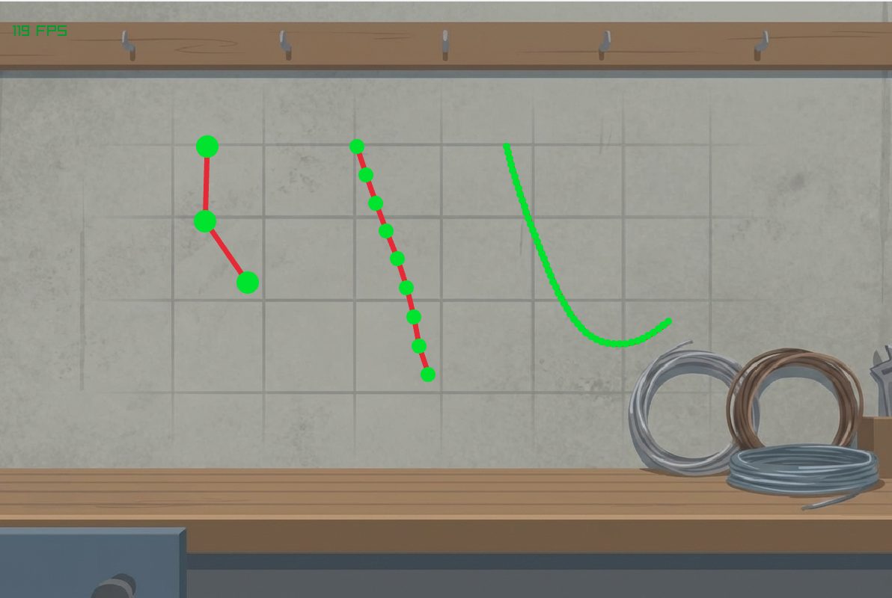

# Rope Physics Simulation

A 2D rope physics simulation built with C++ and Raylib.
Currently, it features Verlet integration for realistic rope movement and mouse interaction.

Made to be an example of a rope simulation for educational purposes or as a base for your own rope simuation.



## Documentation
- the scripts are well commented, code is written to be simple and readable, however ther is **No official documentation** beyond the source comments.

## Features
- **Physics**: Custom physics solver using Verlet integration.
- **Interaction**: Drag and drop rope nodes with the mouse (Right Click to move the camera, hold Left Click to drag).

## Installation
1. Clone the repository.
2. Open `RopeSim.sln` in Visual Studio 2022.
3. Select **Debug** or **Release** and hit **F5** to build and run.

## Workflow
- **setup your rope**: ```C++   std::vector<RopeNode> Rope3 = RopePhysicsSolver::SetupRope(Vector2{600,100}, true, 100, 10, 6); ```*a rope with the first node at the position X: 600; Y: 100, first node is anchored (pinned, cant move), 100 nodes in total, the maximum distance between each node is 10 units, each node's radius is 6 units*
- **Uptade rope physics**: ```C++  RopePhysicsSolver::UpdateRope(Rope3, 0.0083333);    ```*using 1/120 timestep or higher is recomended*
- **Allow rope manipulation via cursor interaction**: ```C++    MoveRopeNode(Rope, mainCamera);    ```

## Controls
- **Left Mouse**: Drag rope nodes.
- **Right Mouse**: Pan the camera.
- **Scroll Wheel**: Zoom.

## Acknowledgments
- [Raylib](https://www.raylib.com/) for the simple graphics library.
- Verlet integration technique for stable physics.
- Various Youtube tutorials and other educational sources.


## Limitations & Notes
- Some constants (like gravity) are tuned specifically for Raylib's coordinate system
- Porting to other frameworks may require parameter adjustments
- Currently single-threaded (see TO-DO for planned features)


### TO-DO:
1. Refactor some functions and classes.
1. Add functions to update physics and interaction across all existing ropes.
1. Implement UI via raygui.
1. Add dynamic rope creation at runtime
1. 
1. Add more types of rope constraints
1. Add multi-threading
1. Improve rendering